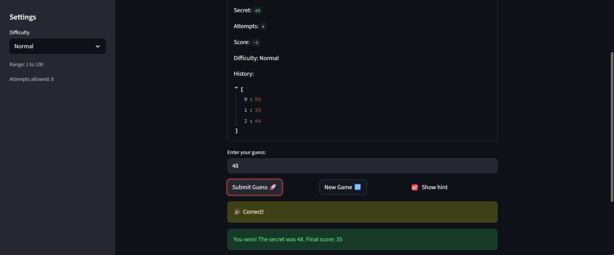
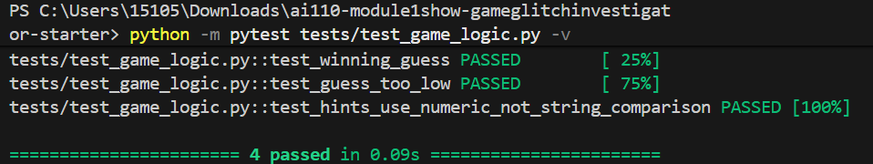

# 🎮 Game Glitch Investigator: The Impossible Guesser

## 🚨 The Situation

You asked an AI to build a simple "Number Guessing Game" using Streamlit.
It wrote the code, ran away, and now the game is unplayable. 

- You can't win.
- The hints lie to you.
- The secret number seems to have commitment issues.

## 🛠️ Setup

1. Install dependencies: `pip install -r requirements.txt`
2. Run the broken app: `python -m streamlit run app.py`

## 🕵️‍♂️ Your Mission

1. **Play the game.** Open the "Developer Debug Info" tab in the app to see the secret number. Try to win.
2. **Find the State Bug.** Why does the secret number change every time you click "Submit"? Ask ChatGPT: *"How do I keep a variable from resetting in Streamlit when I click a button?"*
3. **Fix the Logic.** The hints ("Higher/Lower") are wrong. Fix them.
4. **Refactor & Test.** - Move the logic into `logic_utils.py`.
   - Run `pytest` in your terminal.
   - Keep fixing until all tests pass!

## 📝 Document Your Experience

**What the game does:** its a number guessing game where you try to guess a secret number and it tells you higher or lower until you get it or run out of tries.

**Bugs I found:**
- the hints were backwards, if i guessed too high it still said go higher
- the New Game button didnt work, the game just stayed frozen after winning or losing
- the hint messages were also just swapped in the code like Go HIGHER was on the wrong outcome

**What I fixed:**
- moved the game logic into logic_utils.py
- removed the part that was turning the secret number into a string, that was causing the wrong comparisons
- swapped the Go HIGHER and Go LOWER messages so they match the right outcomes
- wrote a test to make sure check_guess(7, 42) returns Too Low, ran pytest and all 4 passed

## 📸 Demo

**pytest results — all 4 tests passing:**

## 🚀 Stretch Features

- [ ] [If you choose to complete Challenge 4, insert a screenshot of your Enhanced Game UI here]
